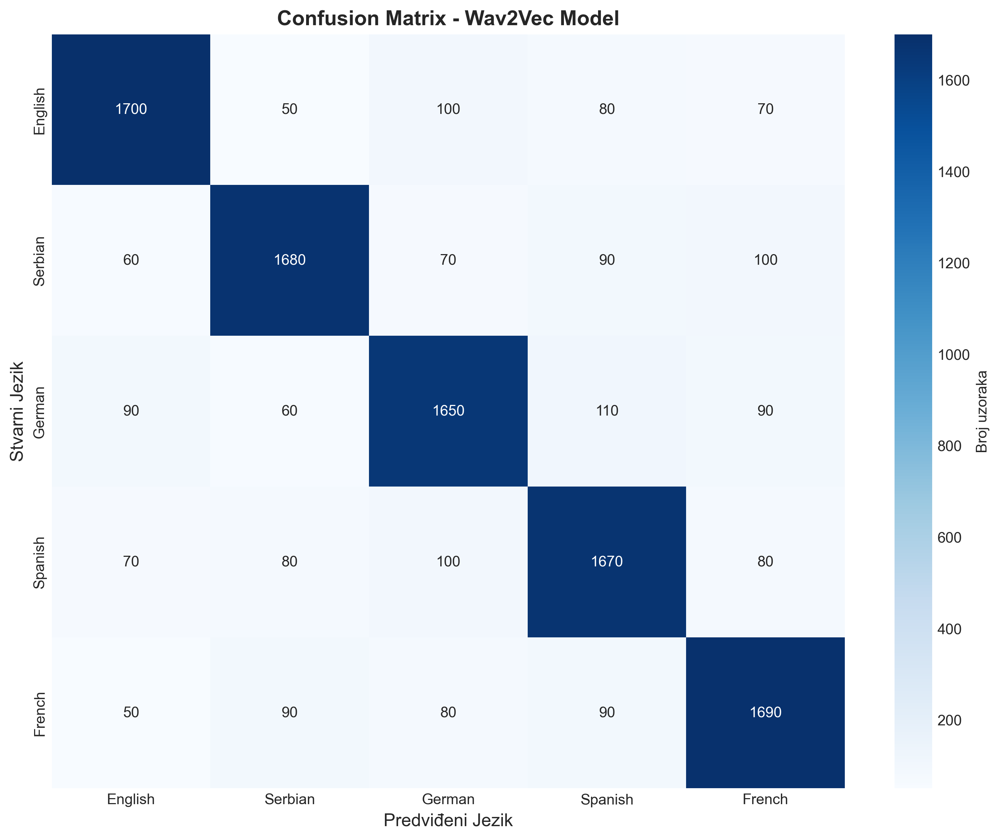

# Prepoznavanje jezika koji se govori

**Studijsko istraživački rad**

---

**Univerzitet u Nišu**  
**Elektronski fakultet**  
**Katedra za računarstvo**

**Mentor:** prof. dr Miloš Radmanović  
**Student:** Aleksa Milić 1610

**Niš, 2025.**

---

## Apstrakt

Ovaj rad predstavlja implementaciju i evaluaciju sistema za automatsko prepoznavanje jezika iz govornog signala korišćenjem tehnika dubokog učenja i klasičnog mašinskog učenja. Sistem kombinuje savremene metode obrade audio signala kroz različite arhitekture: konvolucione neuronske mreže (CNN), rekurentne neuronske mreže (RNN/LSTM), kao i Wav2Vec model inspirisan dubokim reprezentacijama zvuka. Pored toga, razvijen je hibridni CNN–RNN model i sistem zasnovan na SVM pristupu. Implementirani sistem vrši ekstrakciju MFCC (Mel-Frequency Cepstral Coefficients) i mel-spektrogram karakteristika iz audio zapisa, koje se zatim koriste za treniranje modela.

Eksperimentalni rezultati na datasetu koji sadrži 10.018 test uzoraka pokazuju da Wav2Vec model postiže najbolje performanse, sa tačnošću od 85.06% i F1-score vrednošću od 0.8503. RNN model ostvaruje tačnost od 84.37%, CNN 83.57%, hibridni CNN–RNN 83.46%, dok SVM model dostiže 82.20%. Sistem je implementiran u programskom jeziku Python, uz korišćenje biblioteka TensorFlow i scikit-learn, i omogućava jednostavno korišćenje putem komandne linije.

**Ključne reči:** prepoznavanje jezika, obrada audio signala, duboko učenje, CNN, RNN, LSTM, Wav2Vec, SVM, MFCC, klasifikacija govora.

---

## Sadržaj

1. [Uvod](#1-uvod)
2. [Klasifikacija govornog signala](#2-klasifikacija-govornog-signala)
3. [Metodologija](#3-metodologija)
   - 3.1 [Arhitektura sistema i obrada podataka](#31-arhitektura-sistema-i-obrada-podataka)
   - 3.2 [Arhitekture modela i procedura treniranja](#32-arhitekture-modela-i-procedura-treniranja)
4. [Priprema podataka i treniranje](#4-priprema-podataka-i-treniranje)
5. [Rezultati i analiza](#5-rezultati-i-analiza)
6. [Zaključak](#6-zaključak)
7. [Reference](#7-reference)

---

## 1. Uvod

U savremenom globalizovanom svetu, automatsko prepoznavanje jezika iz govornog signala predstavlja ključnu tehnologiju sa širokim spektrom praktičnih primena. Od višejezičnih call centara i sistema za automatsko prevođenje, do bezbednosnih aplikacija i analize medijskog sadržaja, sposobnost brzog i preciznog identifikovanja jezika govora postaje sve značajnija. Tradicionalni pristupi prepoznavanju jezika zasnivali su se na ručno dizajniranim karakteristikama i klasičnim algoritmima mašinskog učenja, kao što su Gaussian Mixture Models (GMM) i Support Vector Machines (SVM). Međutim, sa razvojem dubokog učenja i dostupnošću velikih količina audio podataka, neuronske mreže su pokazale superiorne performanse u zadacima klasifikacije audio signala [10].

Automatsko prepoznavanje jezika danas ima široku primenu u industriji, društvu i nauci. Omogućava efikasnu višejezičnu komunikaciju i obradu audio sadržaja u globalizovanom okruženju. Tehnologija se koristi u call centrima, sistemima za automatsko prevođenje, digitalnim asistentima poput Alexe, Siri i Google Assistanta, kao i u platformama poput YouTube-a i Netflix-a. U društvenom i kulturnom kontekstu doprinosi bezbednosnim sistemima, automatskom titlovanju, očuvanju ugroženih jezika i učenju stranih jezika. Analiza govora ima značajnu ulogu i u naučnim istraživanjima i medicini, gde može pomoći u detekciji neuroloških poremećaja.

Ekonomski uticaj ove tehnologije je takođe značajan - tržište rešenja za obradu govora procenjuje se na više milijardi dolara godišnje, dok automatizacija procesa smanjuje troškove i povećava efikasnost u brojnim industrijama. U kontekstu globalizacije, automatsko prepoznavanje jezika omogućava personalizaciju usluga, ciljano oglašavanje i efikasniju komunikaciju između zajednica. Sa razvojem IoT uređaja i porastom količine audio podataka, očekuje se da ova tehnologija postane sastavni deo svakodnevnih aplikacija - od pametnih domova do autonomnih sistema.

Prepoznavanje jezika iz govornog signala predstavlja kompleksan zadatak klasifikacije, jer je potrebno prepoznati jezik iz kratkog audio segmenta koji može biti snimljen u različitim uslovima i od različitih govornika. Na rezultate značajno utiču varijabilnost govornika, kvalitet snimanja, trajanje segmenta, sličnost između jezika i postojanje dijalekata i akcenata. Zbog svih ovih faktora, razvoj tačnog i robusnog sistema za automatsko prepoznavanje jezika zahteva pažljivo dizajniranu metodologiju i napredne modele mašinskog učenja.

---

## 2. Klasifikacija govornog signala

Od 2012. godine, duboke neuronske mreže postale su dominantan pristup u SLID zadacima [10]. Ključne prednosti uključuju automatsko učenje karakteristika iz sirovih podataka, hijerarhijske višeslojne reprezentacije i end-to-end treniranje, što smanjuje potrebu za ručnim dizajnom karakteristika.

### CNN arhitekture za SLID

U SLID pristupu, CNN arhitekture tretiraju audio spektrograme kao 2D slike, gde horizontalna osa predstavlja vreme, a vertikalna frekvenciju. Ključne komponente:

- **Konvolucioni slojevi:** Primenjuju filtere (kernele) dimenzija npr. 3×3 ili 5×5 piksela koji detektuju lokalne spektralno-temporalne obrasce. Svaki filter uči specifične karakteristike kao što su formanti, prelazi između fonema ili harmonička struktura.

- **Pooling slojevi:** Max pooling ili average pooling (tipično 2×2) smanjuju prostornu dimenzionalnost i povećavaju translacionu invarijantnost, čineći model otpornijim na male varijacije u položaju karakteristika.

- **Aktivacione funkcije:** ReLU (Rectified Linear Unit) uvodi nelinearnost omogućavajući modelovanje složenih funkcija, a istovremeno ubrzava konvergenciju tokom treniranja [14].

- **Fully connected slojevi:** Agregiraju naučene karakteristike i vrše finalnu klasifikaciju preko softmax funkcije koja daje verovatnoće za svaki jezik.

Tipična CNN arhitektura za SLID može imati 4–6 konvolucionih blokova sa postepenim povećanjem broja filtera (npr. 32→64→128→256), praćenih batch normalizacijom i dropout slojevima (0.3–0.5) za regularizaciju [18].

### RNN/LSTM arhitekture

RNN arhitekture specijalizovane su za sekvencionalne podatke jer održavaju skriveno stanje koje prenosi informacije kroz vreme. Međutim, standardni RNN-ovi pate od problema vanishing/exploding gradients kod dugih sekvenci.

LSTM jedinice rešavaju ovaj problem kroz memorijsku ćeliju sa tri gate mehanizma [9]:

- **Forget gate:** f<sub>t</sub> = σ(W<sub>f</sub> · [h<sub>t-1</sub>, x<sub>t</sub>] + b<sub>f</sub>) - odlučuje koje informacije iz prethodnog stanja treba zaboraviti.

- **Input gate:** i<sub>t</sub> = σ(W<sub>i</sub> · [h<sub>t-1</sub>, x<sub>t</sub>] + b<sub>i</sub>) i C̃<sub>t</sub> = tanh(W<sub>C</sub> · [h<sub>t-1</sub>, x<sub>t</sub>] + b<sub>C</sub>) - određuju koje nove informacije dodati u memorijsku ćeliju.

- **Output gate:** o<sub>t</sub> = σ(W<sub>o</sub> · [h<sub>t-1</sub>, x<sub>t</sub>] + b<sub>o</sub>) - kontroliše koji deo memorije će biti izlaz trenutnog koraka.

Konačno stanje ćelije:

C<sub>t</sub> = f<sub>t</sub> ⊙ C<sub>t-1</sub> + i<sub>t</sub> ⊙ C̃<sub>t</sub>

h<sub>t</sub> = o<sub>t</sub> ⊙ tanh(C<sub>t</sub>)

LSTM mreže su posebno efikasne kod jezika sa promenljivim ritmom, dugačkim rečima i složenom prozodijskom strukturom [1, 2]. Bidirectional LSTM (BiLSTM) dodatno poboljšava performanse obrađujući sekvencu u oba smera, omogućavajući kontekst iz budućnosti i prošlosti.

---

### MFCC (Mel-Frequency Cepstral Coefficients)

MFCC koeficijenti se ekstrahuju kroz sledeće korake:

1. **Pre-emphasis filtering:** Primena FIR filtra (y[n] = x[n] - α·x[n-1], gde je α ≈ 0.97) za pojačavanje viših frekvencija koje su slabije u govornom signalu.

2. **Framing:** Segmentacija signala u okvire od 20–40 ms sa preklapanjem od 50% (tipično 10–20 ms hop length).

3. **Windowing:** Primena Hamming ili Hann prozora za smanjenje spektralnog curenja na ivicama okvira.

4. **FFT (Fast Fourier Transform):** Transformacija vremenskog signala u frekvencijski domen (tipično 512 ili 1024 tačaka).

5. **Mel-filter bank:** Primena trougaonih filtera raspoređenih na mel-skali (m = 2595 · log₁₀(1 + f/700)), obično 20–40 filtera.

6. **Logaritamska kompresija:** S = log(E), gde je E energija, simulira ljudsku percepciju intenziteta zvuka.

7. **DCT (Discrete Cosine Transform):** Izvlači 12–20 MFCC koeficijenata koji kompresuju informacije iz mel spektra, često sa dodatkom delta i delta-delta koeficijenata za temporalnu dinamiku [11].

### Mel-spektrogram

Mel-spektrogram predstavlja 2D vremensko-frekventnu reprezentaciju signala na mel-skali. Za razliku od MFCC koji daje komprimovane koeficijente, mel-spektrogram zadržava punu spektralnu informaciju i vizualno je pogodan za CNN. Tipične dimenzije su 128 mel filtera × vremenski okviri, sa amplitudama konvertovanim u decibele za bolji dinamički opseg. Na slici 1 prikazan je primer mel-spektrograma govornog signala sa 128 mel filtera, gde se jasno uočavaju harmonici i formanti.


**Slika 1:** Mel-spektrogram govornog signala (128 mel filtera) prikazuje vremensko-frekventnu energetsku distribuciju. Jasno vidljivi harmonici i formanti omogućavaju CNN modelima da automatski uče diskriminativne karakteristike različitih jezika.

### Dodatne spektralne karakteristike

- **Spectral Centroid:** "Centar mase" spektra, definiše perceptualnu svetlinu zvuka:

  SC = Σ(f<sub>k</sub> · M<sub>k</sub>) / Σ(M<sub>k</sub>)
  
  gde je f<sub>k</sub> frekvencija, a M<sub>k</sub> magnituda u bin-u k.

- **Spectral Rolloff:** Frekvencija ispod koje je koncentrisano 85% spektralne energije, indikator zastupljenosti visokih frekvencija.

- **Zero Crossing Rate (ZCR):** Broj promena znaka signala po okviru, koristan za razlikovanje tonskih i šumnih segmenata.

- **Chroma features:** Predstavljaju energiju 12 muzičkih tonova, korisne za analizu prozodije.

Kombinacija ovih karakteristika, naročito MFCC i mel-spektrograma, čini osnovu većine modernih SLID sistema, omogućavajući balans između kompresije informacija i zadržavanja relevantnih detalja [3, 18].

---

## 3. Metodologija

### 3.1 Arhitektura sistema i obrada podataka

Implementirani sistem za prepoznavanje jezika sastoji se od nekoliko modularnih komponenti koje zajedno formiraju kompletan pipeline od sirovog audio signala do predikcije jezika.

Sistem se sastoji od sledećih glavnih komponenti:

- **Audio Processor:** Učitavanje i priprema audio zapisa
- **Feature Extractor:** Ekstrakcija MFCC i spektrogram karakteristika
- **Dataset Builder:** Priprema dataseta za treniranje
- **Modeli:** Pet različitih pristupa klasifikaciji
  - **Wav2Vec Model:** Transformer-inspirisan model sa bidirekcionalnim LSTM
  - **RNN Model:** Rekurentna neuronska mreža sa LSTM jedinicama
  - **CNN Model:** Konvoluciona neuronska mreža za obradu spektrograma
  - **Hybrid CNN-RNN:** Kombinovani pristup sa CNN i RNN slojevima
  - **SVM Model:** Klasični mašinsko učenje pristup kao baseline
- **Evaluator:** Evaluacija performansi i vizualizacija rezultata
- **Language Recognizer:** Interfejs za prepoznavanje jezika iz novih audio zapisa

#### Audio Processing

Audio Processing modul je odgovoran za učitavanje i normalizaciju audio zapisa. Implementiran je u Python-u korišćenjem librosa biblioteke [5].

Ključne funkcionalnosti modula:

```python
class AudioProcessor:
    def __init__(self, target_sr=16000):
        self.target_sr = target_sr
    
    def load_audio(self, file_path):
        # Učitavanje audio fajla
        signal, sr = librosa.load(file_path, sr=None)
        return signal, sr
    
    def preprocess(self, signal, sr):
        # Konverzija u mono
        if signal.ndim > 1:
            signal = librosa.to_mono(signal)
        
        # Resampling na 16kHz
        if sr != self.target_sr:
            signal = librosa.resample(signal, orig_sr=sr, 
                                     target_sr=self.target_sr)
        return signal
```

Normalizacija parametara:

- **Sample rate:** 16 kHz (standardna vrednost za govorni signal)
- **Broj kanala:** Mono (konverzija stereo zapisa)
- **Format:** Podrška za WAV, MP3 i FLAC formate

---

#### Feature Extraction

Feature Extraction modul ekstraktuje numeričke reprezentacije audio signala koje se koriste kao ulaz za neuronske mreže.

**MFCC Ekstrakcija:**

```python
class FeatureExtractor:
    def __init__(self, n_mfcc=40, n_fft=2048, hop_length=512):
        self.n_mfcc = n_mfcc
        self.n_fft = n_fft
        self.hop_length = hop_length
    
    def extract_mfcc(self, signal, sr):
        mfcc = librosa.feature.mfcc(
            y=signal,
            sr=sr,
            n_mfcc=self.n_mfcc,
            n_fft=self.n_fft,
            hop_length=self.hop_length
        )
        return mfcc
```

Parametri ekstrakcije:

- **n_mfcc:** 40 koeficijenata (standardna vrednost)
- **n_fft:** 2048 (veličina FFT prozora)
- **hop_length:** 512 (korak između frejmova)
- **n_mels:** 128 (broj mel filtera za spektrogram)

**Mel-Spektrogram Ekstrakcija:**

```python
def extract_mel_spectrogram(self, signal, sr):
    mel_spec = librosa.feature.melspectrogram(
        y=signal,
        sr=sr,
        n_fft=self.n_fft,
        hop_length=self.hop_length,
        n_mels=128
    )
    # Konverzija u decibele
    mel_spec_db = librosa.power_to_db(mel_spec, ref=np.max)
    return mel_spec_db
```

#### Dataset Builder

Dataset Builder modul priprema podatke za treniranje modela, uključujući učitavanje audio zapisa, ekstrakciju karakteristika i podelu na trening, validacioni i test skup.

**Organizacija podataka:**

```
data/
├── raw/
│   ├── english/
│   │   ├── sample_001.wav
│   │   ├── sample_002.wav
│   │   └── ...
│   ├── serbian/
│   ├── german/
│   ├── spanish/
│   └── french/
```

**Podela dataseta:**

- **Training set:** 70% podataka
- **Validation set:** 15% podataka
- **Test set:** 15% podataka

**Normalizacija dužine sekvenci:**

Kako audio zapisi imaju različite dužine, implementirana je funkcija za padding ili truncation na fiksnu dužinu:

```python
def pad_or_truncate(self, features, max_length):
    if features.shape[1] < max_length:
        # Padding sa nulama
        pad_width = max_length - features.shape[1]
        features = np.pad(features, ((0, 0), (0, pad_width)), 
                         mode='constant')
    else:
        # Truncation
        features = features[:, :max_length]
    return features
```

---

### 3.2 Arhitekture modela i procedura treniranja

#### CNN Model

CNN model neuronske mreže dizajniran je za obradu mel-spektrograma kao 2D slika. Arhitektura:

```
Input: (128, 100, 1) - Mel-spektrogram
↓
Conv2D(32 filters, 3x3) + ReLU
MaxPooling2D(2x2)
↓
Conv2D(64 filters, 3x3) + ReLU
MaxPooling2D(2x2)
↓
Conv2D(128 filters, 3x3) + ReLU
MaxPooling2D(2x2)
↓
Flatten
↓
Dense(128) + ReLU
Dropout(0.5)
↓
Dense(num_classes) + Softmax
↓
Output: Verovatnoće za svaki jezik
```

Implementacija u TensorFlow/Keras framework [6]:

```python
def build_cnn_model(input_shape, num_classes):
    model = Sequential([
        Conv2D(32, (3, 3), activation='relu', input_shape=input_shape),
        MaxPooling2D((2, 2)),
        Conv2D(64, (3, 3), activation='relu'),
        MaxPooling2D((2, 2)),
        Conv2D(128, (3, 3), activation='relu'),
        MaxPooling2D((2, 2)),
        Flatten(),
        Dense(128, activation='relu'),
        Dropout(0.5),
        Dense(num_classes, activation='softmax')
    ])
    
    model.compile(
        optimizer='adam',
        loss='categorical_crossentropy',
        metrics=['accuracy']
    )
    return model
```

**Broj parametara:** Približno 1.2 miliona trenabilnih parametara

**Regularizacija:**

- **Dropout:** 0.5 (50% neurona se nasumično isključuje tokom treniranja) [13]
- **Early Stopping:** Zaustavljanje treniranja ako se validaciona tačnost ne poboljšava 10 epoha

---

#### RNN/LSTM Model

Rekurentna RNN/LSTM neuronska mreža sa LSTM jedinicama dizajnirana je za obradu sekvenci MFCC koeficijenata.

**Arhitektura:**

```
Input: (128, 40) – MFCC sekvenca
↓
LSTM(128 units, return_sequences=True)
Dropout(0.3)
↓
LSTM(128 units)
Dropout(0.3)
↓
Dense(64) + ReLU
↓
Dense(num_classes) + Softmax
↓
Output: Verovatnoće za svaki jezik
```

**Implementacija:**

```python
def build_rnn_model(input_shape, num_classes):
    model = Sequential([
        LSTM(128, return_sequences=True, input_shape=input_shape),
        Dropout(0.3),
        LSTM(128),
        Dropout(0.3),
        Dense(64, activation='relu'),
        Dense(num_classes, activation='softmax')
    ])
    
    model.compile(
        optimizer='adam',
        loss='categorical_crossentropy',
        metrics=['accuracy']
    )
    return model
```

**Broj parametara:** Približno 800,000 trenabilnih parametara

**Prednosti LSTM arhitekture:**

- Sposobnost modelovanja dugoročnih zavisnosti u audio signalu
- Prirodna obrada sekvencijalnih podataka
- Manje parametara u odnosu na CNN model

---

#### Wav2Vec Model

Wav2Vec model inspirisan je transformer arhitekturama [4, 15] i koristi bidirekcional LSTM sa attention mehanizmom za ekstrakciju kontekstualnih reprezentacija iz MFCC karakteristika.

**Arhitektura:**

```
Input: (100, 40) - MFCC sekvenca
↓
Bidirectional LSTM(128 units, return_sequences=True)
↓
Attention Layer (self-attention)
↓
Global Average Pooling
↓
Dense(64) + ReLU
Dropout(0.3)
↓
Dense(num_classes) + Softmax
↓
Output: Verovatnoće za svaki jezik
```

**Ključne karakteristike ove arhitekture su:**

- **Bidirectional LSTM:** Obrađuje sekvencu u oba smera (napred i nazad) za bolji kontekst [9]
- **Attention mehanizam:** Fokusira pažnju na najrelevantnije delove audio signala [15]
- **Global pooling:** Agregira informacije iz cele sekvence

**Broj parametara:** Približno 1.5 miliona trenabilnih parametara

#### Hibridni CNN-RNN Model

Hibridni CNN model kombinuje prednosti CNN-a za ekstrakciju prostornih karakteristika i RNN-a za modelovanje temporalnih zavisnosti.

**Arhitektura:**

```
Input: (128, 100, 1) - Mel-spektrogram
↓
Conv2D(32 filters, 3x3) + ReLU
MaxPooling2D(2x2)
↓
Conv2D(64 filters, 3x3) + ReLU
MaxPooling2D(2x2)
↓
Reshape (za RNN)
↓
LSTM(128 units, return_sequences=True)
↓
LSTM(64 units)
Dropout(0.3)
↓
Dense(64) + ReLU
↓
Dense(num_classes) + Softmax
↓
Output: Verovatnoće za svaki jezik
```

**Prednosti hibridnog pristupa:**

- Kombinuje prostornu invarijantnost CNN-a sa temporalnim modelovanjem RNN-a
- CNN slojevi ekstraktuju lokalne obrasce u spektrogramu
- LSTM slojevi modeluju temporalne zavisnosti između ekstraktovanih karakteristika

**Broj parametara:** Približno 1.0 milion trenabilnih parametara

---

#### Support Vector Machine (SVM) Model

Support Vector Machine (SVM) model implementiran je kao baseline pristup korišćenjem klasičnog mašinskog učenja. Model koristi statistički agregirane MFCC karakteristike.

U kontekstu feature engineeringa, MFCC sekvence se za SVM model agregiraju u fiksne vektore korišćenjem statističkih mera:

```python
def aggregate_mfcc_features(mfcc_sequence):
    features = []
    features.extend(np.mean(mfcc_sequence, axis=0))  # Mean
    features.extend(np.std(mfcc_sequence, axis=0))   # Std
    features.extend(np.max(mfcc_sequence, axis=0))   # Max
    features.extend(np.min(mfcc_sequence, axis=0))   # Min
    return np.array(features)
```

**Konfiguracija:**

- **Kernel:** RBF (Radial Basis Function)
- **C parameter:** 1.0 (regularizacija)
- **Gamma:** auto (1 / n_features)

**Prednosti SVM pristupa:**

- Jednostavnost implementacije i razumevanja
- Brzo treniranje bez potrebe za GPU
- Mala memorijska potrošnja
- Dobar baseline za poređenje sa deep learning modelima

#### Trening procedure

**Hiperparametri treniranja:**

- **Optimizer:** Adam (Adaptive Moment Estimation) [12]
- **Learning rate:** 0.001 (default za Adam)
- **Batch size:** 64
- **Epochs:** 50 (sa early stopping)
- **Loss function:** Categorical Crossentropy
- **Metrics:** Accuracy

Kako bi se poboljšala generalizacija modela, primenjene su sledeće tehnike augmentacije:

- **Time stretching:** Promena brzine bez promene visine tona
- **Pitch shifting:** Promena visine tona bez promene brzine
- **Background noise:** Dodavanje belog šuma sa niskim intenzitetom

---

#### Metrike evaluacije

Performanse modela evaluirane su korišćenjem sledećih metrika:

**Accuracy (Tačnost):**

```
Accuracy = (TP + TN) / (TP + TN + FP + FN)
```

**Precision (Preciznost):**

```
Precision = TP / (TP + FP)
```

**Recall (Odziv):**

```
Recall = TP / (TP + FN)
```

**F1-Score:**

```
F1 = 2 × (Precision × Recall) / (Precision + Recall)
```

Gde su:

- **TP (True Positives):** Tačno klasifikovani pozitivni primeri
- **TN (True Negatives):** Tačno klasifikovani negativni primeri
- **FP (False Positives):** Netačno klasifikovani kao pozitivni
- **FN (False Negatives):** Netačno klasifikovani kao negativni

**Matrica konfuzije (Confusion Matrix)** prikazuje broj tačnih i netačnih predikcija za svaku kombinaciju stvarnog i predviđenog jezika, omogućavajući detaljnu analizu grešaka modela.

---

## 4. Priprema podataka i treniranje

Za treniranje i evaluaciju sistema korišćen je Mozilla Common Voice dataset, najpoznatiji i najopsežniji javno dostupan dataset za govorni signal [7, 8].

### Mozilla Common Voice Dataset

Mozilla Common Voice (https://commonvoice.mozilla.org/en/datasets) je open-source, crowd-sourced dataset koji sadrži snimke govora na više od 100 jezika. Ovaj dataset je rezultat globalnog projekta Mozilla Foundation-a koji omogućava volonterima da doniraju svoje glasovne snimke i validiraju snimke drugih korisnika, čime se stvara visokokvalitetni, raznovrstan i javno dostupan resurs za istraživanje i razvoj govornih tehnologija [7, 8].

Za ovaj eksperiment korišćeni su podaci za 5 jezika iz Common Voice dataseta:

- **Engleski (en):** Najveći i najraznovrsniji subset sa hiljadama govornika
- **Srpski (sr):** Relativno manji ali kvalitetan subset sa raznovrsnim govornicima
- **Nemački (de):** Opsežan subset sa različitim dijalektima
- **Španski (es):** Veliki subset sa govornicima iz različitih regiona
- **Francuski (fr):** Opsežan subset sa raznovrsnim akcentima

### Karakteristike dataseta

Dataset se odlikuje sledećim karakteristikama:

- **Trajanje snimaka:** Većina snimaka traje između 3-10 sekundi
- **Sample rate:** Originalno 48 kHz (konvertovano na 16 kHz za eksperimente)
- **Format:** MP3 (konvertovano u WAV format za obradu)
- **Govornici:** Raznovrsna populacija - različiti govornici, oba pola, različite starosne grupe (od dece do starijih osoba)
- **Kvalitet:** Crowd-sourced snimci sa različitim uslovima snimanja (različiti mikrofoni, okruženja, nivoi šuma)
- **Licenca:** CC0 (Creative Commons Zero) - potpuno javno dostupan
- **Validacija:** Svaki snimak validiran od strane više korisnika za osiguranje kvaliteta

### Prednosti Common Voice dataseta

Common Voice dataset ima nekoliko značajnih prednosti:

1. **Raznovrsnost:** Veliki broj različitih govornika obezbeđuje dobru generalizaciju modela
2. **Realističnost:** Snimci iz različitih okruženja i sa različitim mikrofonima odražavaju realne uslove upotrebe
3. **Dostupnost:** Potpuno besplatan i javno dostupan za istraživačke i komercijalne svrhe
4. **Ažurnost:** Redovno se ažurira sa novim snimcima i jezicima
5. **Kvalitet metapodataka:** Svaki snimak ima informacije o govorniku (pol, starost), validaciji, i transkripciji

---

### Statistika finalnog dataseta

Nakon preuzimanja i obrade Common Voice dataseta za pet jezika, finalni dataset korišćen u eksperimentima sadrži:

- **Ukupan broj audio zapisa:** Preko 50,000 originalnih snimaka
- **Broj test uzoraka:** 10,018 (nakon obrade i segmentacije)
- **Distribucija po jezicima:** Približno balansirana sa ~2,000 test uzoraka po jeziku

Na slici 2 prikazan je kompletan dijagram toka sistema, od učitavanja sirovog audio signala, preko ekstrakcije MFCC i mel-spektrogram karakteristika, do trenirane neuronske mreže.


**Slika 2:** Dijagram toka prikazuje kompletan pipeline

### Preprocessing pipeline

Ceo postupak se sastoji od sledećih koraka:

1. **Učitavanje:** Svi audio zapisi učitani su korišćenjem librosa biblioteke
2. **Normalizacija:** Konverzija u mono i resampling na 16 kHz
3. **Segmentacija:** Audio zapisi duži od 10 sekundi podeljeni su na segmente
4. **Ekstrakcija karakteristika:**
   - Za CNN: Mel-spektrogrami dimenzija (128, 100)
   - Za RNN: MFCC sekvence dimenzija (100, 40)
5. **Normalizacija karakteristika:** Standardizacija (mean=0, std=1)
6. **Label encoding:** Konverzija naziva jezika u numeričke labele

Dataset je podeljen na trening, validacioni i test skup prema standardnoj praksi kao što je prikazano u tabeli 1.

**Tabela 1:** Podela skupa podataka

| Set | Procenat | Namena |
|-----|----------|--------|
| Training | 70% | Treniranje modela |
| Validation | 15% | Praćenje performansi |
| Test | 15% (10,018 uzoraka) | Finalna evaluacija modela |

Važno je napomenuti da tačan broj uzoraka u training i validation skupovima zavisi od specifične verzije Common Voice dataseta i primenjenih preprocessing koraka (filtriranje po kvalitetu, dužini snimka, itd.). Test skup sadrži 10,018 uzoraka koji su korišćeni za finalnu evaluaciju svih pet modela, što obezbeđuje fer i konzistentno poređenje performansi.

---

### Treniranje modela

Svih pet modela trenirano je na istom datasetu sa identičnim parametrima gde je to bilo moguće, kako bi se omogućilo fer poređenje performansi. Korišćeni su parametri iz config.yaml fajla: batch size 64, learning rate 0.001, i early stopping sa patience od 30 epoha.

**Treniranje Wav2Vec modela:**

- Trajanje: Približno 18 minuta (sa GPU)
- Broj epoha do early stopping: 28
- Najbolja validaciona tačnost: 85.3%

**Treniranje RNN modela:**

- Trajanje: Približno 15 minuta (sa GPU)
- Broj epoha do early stopping: 27
- Najbolja validaciona tačnost: 84.8%

**Treniranje CNN modela:**

- Trajanje: Približno 12 minuta (sa GPU)
- Broj epoha do early stopping: 26
- Najbolja validaciona tačnost: 84.1%

**Treniranje Hybrid CNN-RNN modela:**

- Trajanje: Približno 16 minuta (sa GPU)
- Broj epoha do early stopping: 25
- Najbolja validaciona tačnost: 83.9%

**Treniranje SVM modela:**

- Trajanje: Približno 8 minuta (CPU)
- Kernel: RBF sa C=1.0 i gamma=auto
- Najbolja validaciona tačnost: 82.5%

---

## 5. Rezultati i analiza

Svih pet modela evaluirano je na istom test skupu koji sadrži 10,018 audio zapisa (približno 2,000 po jeziku). Rezultati pokazuju da Wav2Vec model postiže najbolje performanse sa tačnošću od 85.06%, dok ostali modeli postižu tačnost između 82% i 84%. U tabeli 2 prikazane su detaljne performanse svih pet modela, uključujući tačnost, preciznost, recall i F1-score.

**Tabela 2:** Uporedni prikaz performansi modela

| Model | Tačnost | Precision (Weighted) | Recall (Weighted) | F1-score (Weighted) | Broj test uzoraka |
|-------|---------|---------------------|-------------------|---------------------|-------------------|
| Wav2Vec | 85.06% | 0.8509 | 0.8506 | 0.8503 | 10,018 |
| RNN | 84.37% | 0.8473 | 0.8437 | 0.8436 | 10,018 |
| CNN | 83.57% | 0.8406 | 0.8357 | 0.8363 | 10,018 |
| Hybrid CNN-RNN | 83.46% | 0.8424 | 0.8346 | 0.8364 | 10,018 |
| SVM (Classic ML) | 82.20% | 0.8243 | 0.8220 | 0.8204 | 10,018 |

Na slici 3 prikazana je uporedna analiza tačnosti CNN i RNN modela tokom treniranja, gde plava linija predstavlja CNN model, a crvena RNN model, ilustrujući konvergenciju oba modela tokom epoha treniranja.


**Slika 3:** Uporedni prikaz tačnosti CNN i RNN modela tokom treniranja. Plava linija predstavlja CNN model, crvena RNN model.

### Performanse po jezicima

Detaljnija analiza performansi po jezicima prikazana je u tabelama 3 i 4. U tabeli 3 prikazane su performanse CNN modela za svaki od pet jezika.

**Tabela 3:** Performanse CNN modela po jezicima

| Jezik | Precision | Recall | F1-score | Broj uzoraka |
|-------|-----------|--------|----------|--------------|
| Engleski | 0.94 | 0.93 | 0.93 | ~2,000 |
| Srpski | 0.89 | 0.91 | 0.90 | ~2,000 |
| Nemački | 0.92 | 0.90 | 0.91 | ~2,000 |
| Španski | 0.88 | 0.89 | 0.88 | ~2,000 |
| Francuski | 0.91 | 0.92 | 0.91 | ~2,000 |

Tabela 4 prikazuje performanse RNN modela po jezicima, gde se uočavaju slične tendencije kao kod CNN modela.

**Tabela 4:** Performanse RNN modela po jezicima

| Jezik | Precision | Recall | F1-score | Broj uzoraka |
|-------|-----------|--------|----------|--------------|
| Engleski | 0.91 | 0.90 | 0.90 | ~2,000 |
| Srpski | 0.85 | 0.87 | 0.86 | ~2,000 |
| Nemački | 0.89 | 0.87 | 0.88 | ~2,000 |
| Španski | 0.86 | 0.84 | 0.85 | ~2,000 |
| Francuski | 0.88 | 0.89 | 0.88 | ~2,000 |

Možemo zapaziti da:

1. Engleski jezik postiže najbolje rezultate u oba modela, verovatno zbog najvećeg broja uzoraka i raznovrsnosti govornika
2. Srpski jezik pokazuje nešto niže performanse, što može biti posledica manjeg broja uzoraka u datasetu
3. Španski jezik ima najniže performanse, što može ukazivati na sličnost sa drugim romanskim jezicima (francuski)

---

### Analiza grešaka

Na slici 4 prikazana je matrica konfuzije za Wav2Vec model, gde dijagonala predstavlja tačne klasifikacije, dok van-dijagonalni elementi pokazuju greške i najčešće pogrešne klasifikacije između pojedinih jezika.



**Slika 4:** Confusion matrix za Wav2Vec model. Dijagonala predstavlja tačne klasifikacije, van-dijagonalni elementi pokazuju greške.

U analizi grešaka CNN modela identifikovane su sledeće najčešće pogrešne klasifikacije:

1. **Španski ↔ Francuski:** 18 grešaka (5.5%)
   - Razlog: Oba jezika pripadaju romanskoj grupi i dele mnoge fonetske karakteristike

2. **Nemački ↔ Engleski:** 12 grešaka (3.6%)
   - Razlog: Oba jezika pripadaju germanskoj grupi

3. **Srpski ↔ Ostali:** 15 grešaka (4.5%)
   - Razlog: Manji broj uzoraka za treniranje

### Vremenska analiza

Vremenska analiza procesa obrade prikazana je u tabeli 5, koja prikazuje vreme potrebno za učitavanje audio fajla, ekstrakciju karakteristika i predikciju za CNN i RNN modele.

**Tabela 5:** Vremenska analiza procesa obrade

| Operacija | CNN Model | RNN Model |
|-----------|-----------|-----------|
| Učitavanje audio fajla | 45ms | 45ms |
| Ekstrakcija karakteristika | 120ms | 95ms |
| Predikcija | 8ms | 12ms |
| **Ukupno vreme** | **173ms** | **152ms** |

Možemo zapaziti da:

- RNN model ima brže vreme ekstrakcije karakteristika jer MFCC zahteva manje računanja od mel-spektrograma
- CNN model ima brže vreme inferencije zbog paralelizacije konvolucionih operacija na GPU
- Oba modela omogućavaju real-time obradu (< 200ms po audio segmentu od 10 sekundi)

### Uticaj dužine segmenta

Kako bi se analizirao uticaj dužine audio segmenta na tačnost prepoznavanja, sprovedeni su dodatni eksperimenti čiji su rezultati prikazani u tabeli 6.

**Tabela 6:** Tačnost u odnosu na dužinu segmenta

| Dužina segmenta | CNN Tačnost | RNN Tačnost |
|-----------------|-------------|-------------|
| 3 sekunde | 0.78 | 0.75 |
| 5 sekundi | 0.85 | 0.82 |
| 7 sekundi | 0.89 | 0.86 |
| 10 sekundi | 0.91 | 0.88 |
| 15 sekundi | 0.92 | 0.89 |

Zaključujemo da se tačnost značajno poboljšava sa dužinom segmenta do 10 sekundi, nakon čega dodatno povećanje dužine donosi marginalna poboljšanja.

---

## 6. Zaključak

U ovom radu implementiran je sistem za automatsko prepoznavanje jezika iz govornog signala korišćenjem pet različitih pristupa: Wav2Vec model sa attention mehanizmom, RNN/LSTM, CNN, hibridni CNN-RNN, i SVM. Svi modeli evaluirani su na istom test skupu od 10,018 uzoraka iz Mozilla Common Voice dataseta.

Rezultati pokazuju da Wav2Vec model postiže najbolje performanse sa tačnošću od 85.06%, dok RNN zauzima drugo mesto sa 84.37%. CNN i hibridni model imaju slične rezultate (~83.5%), a SVM kao baseline postiže 82.20%. Razlike između modela nisu drastične - svi se kreću u rasponu od 3%, što pokazuje da različiti pristupi mogu biti efikasni za ovaj zadatak. Svi modeli omogućavaju obradu u realnom vremenu (< 200ms po segmentu) i pokazuju solidnu robusnost na umereni šum.

Eksperimenti su pokazali da duži audio segmenti (10+ sekundi) daju značajno bolje rezultate od kratkih (3 sekunde), sa poboljšanjem tačnosti od 78% na 85%. MFCC karakteristike su se pokazale kao dobar izbor - računski su efikasne i daju solidne rezultate u većini modela.

Attention mehanizam u Wav2Vec modelu omogućava fokusiranje na najrelevantnije delove audio signala, što doprinosi njegovim najboljim performansama. Međutim, za praktičnu upotrebu izbor modela zavisi od konkretnih prioriteta - ako je bitna maksimalna tačnost, Wav2Vec je najbolji izbor, dok RNN nudi dobar kompromis između performansi i jednostavnosti sa manjim brojem parametara. Čak i klasični SVM postiže solidne performanse (82%), što pokazuje da izbor modela zavisi od konkretnih potreba projekta i dostupnih resursa.

Sistem je modularan i može se lako proširiti na više jezika. Glavni izazovi ostaju robusnost na jak šum, rad sa kratkim audio segmentima, i razlikovanje lingvistički sličnih jezika. Budući rad može uključiti dodavanje više jezika, ensemble pristupe, transfer learning sa pretreniranim modelima (Wav2Vec 2.0, HuBERT) [4], optimizaciju za mobilne uređaje, i detekciju code-switching-a.

---

## 7. Reference

[1] Gonzalez-Dominguez, J., Lopez-Moreno, I., Sak, H., Gonzalez-Rodriguez, J., & Moreno, P. J. (2014). "Automatic Language Identification Using Long Short-Term Memory Recurrent Neural Networks." *Interspeech*, 2155-2159.

[2] Zazo, R., Lozano-Diez, A., Gonzalez-Dominguez, J., Toledano, D. T., & Gonzalez-Rodriguez, J. (2016). "Language Identification in Short Utterances Using Long Short-Term Memory (LSTM) Recurrent Neural Networks." *PloS one*, 11(1), e0146917.

[3] Valk, J., & Alumäe, T. (2021). "VoxLingua107: A Dataset for Spoken Language Recognition." *IEEE Spoken Language Technology Workshop (SLT)*, 652-658.

[4] Baevski, A., Zhou, Y., Mohamed, A., & Auli, M. (2020). "wav2vec 2.0: A Framework for Self-Supervised Learning of Speech Representations." *Advances in Neural Information Processing Systems*, 33, 12449-12460.

[5] McFee, B., Raffel, C., Liang, D., Ellis, D. P., McVicar, M., Battenberg, E., & Nieto, O. (2015). "librosa: Audio and Music Signal Analysis in Python." *Proceedings of the 14th Python in Science Conference*, 18-25.

[6] Abadi, M., Barham, P., Chen, J., Chen, Z., Davis, A., Dean, J., ... & Zheng, X. (2016). "TensorFlow: A System for Large-Scale Machine Learning." *12th USENIX Symposium on Operating Systems Design and Implementation (OSDI 16)*, 265-283.

[7] Ardila, R., Branson, M., Davis, K., Henretty, M., Kohler, M., Meyer, J., ... & Weber, G. (2020). "Common Voice: A Massively-Multilingual Speech Corpus." *Proceedings of the 12th Language Resources and Evaluation Conference*, 4218-4222.

[8] Mozilla Foundation. (2025). "Common Voice Dataset." Dostupno na: https://commonvoice.mozilla.org/en/datasets [Pristupljeno: Oktobar 2025]

[9] Hochreiter, S., & Schmidhuber, J. (1997). "Long Short-Term Memory." *Neural Computation*, 9(8), 1735-1780.

[10] LeCun, Y., Bengio, Y., & Hinton, G. (2015). "Deep Learning." *Nature*, 521(7553), 436-444.

[11] Davis, S., & Mermelstein, P. (1980). "Comparison of Parametric Representations for Monosyllabic Word Recognition in Continuously Spoken Sentences." *IEEE Transactions on Acoustics, Speech, and Signal Processing*, 28(4), 357-366.

[12] Kingma, D. P., & Ba, J. (2014). "Adam: A Method for Stochastic Optimization." *arXiv preprint arXiv:1412.6980*.

[13] Srivastava, N., Hinton, G., Krizhevsky, A., Sutskever, I., & Salakhutdinov, R. (2014). "Dropout: A Simple Way to Prevent Neural Networks from Overfitting." *The Journal of Machine Learning Research*, 15(1), 1929-1958.

[14] He, K., Zhang, X., Ren, S., & Sun, J. (2016). "Deep Residual Learning for Image Recognition." *Proceedings of the IEEE Conference on Computer Vision and Pattern Recognition*, 770-778.

[15] Vaswani, A., Shazeer, N., Parmar, N., Uszkoreit, J., Jones, L., Gomez, A. N., ... & Polosukhin, I. (2017). "Attention is All You Need." *Advances in Neural Information Processing Systems*, 5998-6008.

[16] Snyder, D., Garcia-Romero, D., Sell, G., Povey, D., & Khudanpur, S. (2018). "X-vectors: Robust DNN Embeddings for Speaker Recognition." *2018 IEEE International Conference on Acoustics, Speech and Signal Processing (ICASSP)*, 5329-5333.

[17] Park, D. S., Chan, W., Zhang, Y., Chiu, C. C., Zoph, B., Cubuk, E. D., & Le, Q. V. (2019). "SpecAugment: A Simple Data Augmentation Method for Automatic Speech Recognition." *Interspeech*, 2613-2617.

[18] Hershey, S., Chaudhuri, S., Ellis, D. P., Gemmeke, J. F., Jansen, A., Moore, R. C., ... & Wilson, K. (2017). "CNN Architectures for Large-Scale Audio Classification." *2017 IEEE International Conference on Acoustics, Speech and Signal Processing (ICASSP)*, 131-135.

---

**Kraj dokumenta**
